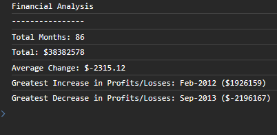

# Console Finances

## Description
This is a financial analysis project of monthly sales data. The analysis has been performed in javascript and it has been engineered to display in the console of a user's browser; having access to the console is a requirement for the purposes of an end user viewing its output.



## Installation

Please clone this repository with the following command in your terminal:

```
git clone https://github.com/jamesaps/console-finances.git
```

## Usage
This code is designed to run from the user's browser. It is set up to automatically deploy to github pages when changes are committed to the main branch. You can find a link to a live version of the site [here](https://jamesaps.github.io/console-finances/).

## Credits
Starter code was provided by eDX.

## License

Licensed under the [MIT](https://github.com/jamesaps/console-finances/blob/main/LICENSE) license.

© 2023 James Stott. Confidential and Proprietary. All Rights Reserved.